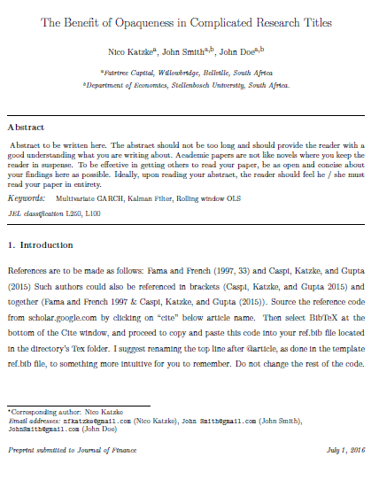

Introduction
============

This package helps a user set up an Elsevier template for writing academic journal reports in Rmarkdown. The setup requires very few lines of code and will get you up and running in *a few seconds* (provided you have all the relevent dependencies installed - see below), with a fully working and good-to-go template.

Using Texevier you can simply start writing your paper / thesis / phd in R after running five lines of code. Your template will look as follows:

Dependencies Required
---------------------

Make sure you have the following installed on your computer:

-   R
-   RStudio
-   Latex (I suggest simply installing Miktex here: <http://miktex.org/download> )

Code
----

After installing all three at the top, simply run the following code:

    if (!require("devtools")) install.packages("devtools")
    library(devtools)
    devtools::install_github("Nicktz/Texevier")
    library(Texevier)
    dir <- choose.dir(default = "C:/Texevier")
    create_template(directory = dir, template_name = "Template")

This will automatically install all the needed files and components, and allow you to start working with an Elsevier template in less than a minute. A pdf will pop up, which you can scroll through to see what your template looks like. REMEMBER to close the pdf before building a new one.

A template.Rmd file will also be opened automatically from the directory provided, which contains all the needed notes on how to write an academic paper in R to produce the pdf example shown. I recommend going through the code in depth for a good reference before you start working.

Motivation
----------

Doing research in R allows you to verify your work easily. This template is designed to save the researcher time in terms of setting up a proper template for doing formal research. This is something which could feel daunting and can be time-consuming for even intermediate LaTeX and R users. This package is intended to get you started in less than a minute.

Feel free to edit the templates and use this as a starting point for your own research.
